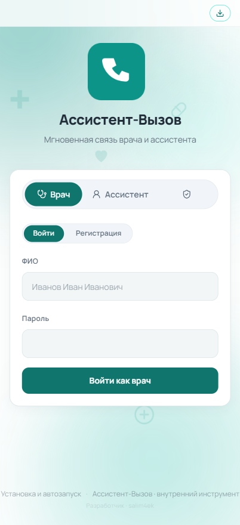
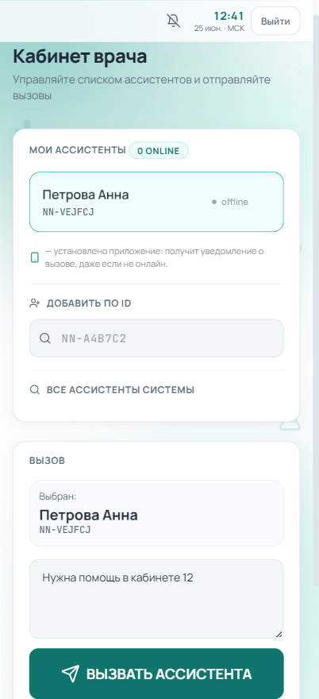
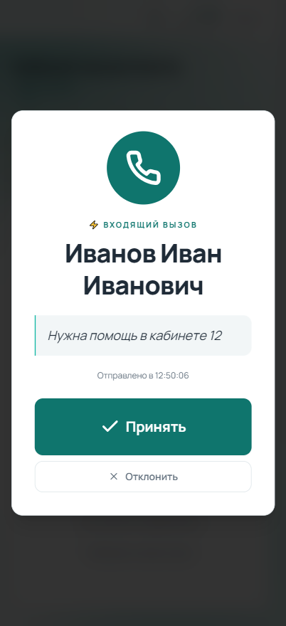
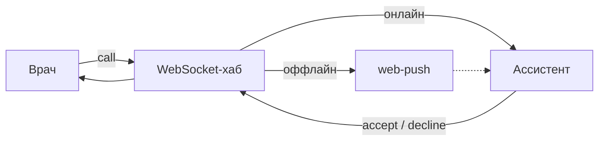
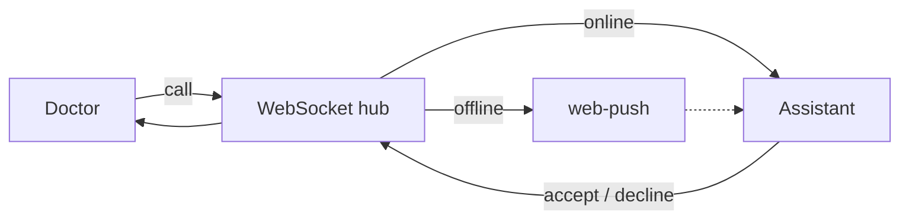

<a name="top"></a>
# NN+ Ассистент-Вызов

> Вызов ассистента в клинике одной кнопкой — окно, звук, системное уведомление и пуш на телефон, даже когда приложение закрыто.

Русский · [English](#en)

Внутренний инструмент для клиники. Врач нажимает одну кнопку — ассистент сразу видит вызов: окно в приложении, звук, системное уведомление и пуш на телефон, даже когда приложение закрыто. Делал, чтобы убрать беготню по коридорам и звонки на ресепшн ради «принесите карту в 12-й».

Крутится в проде в реальной клинике. В репозитории — исходники без секретов, ключей и персональных данных.

[](https://go.dev)
[](https://react.dev)
[](LICENSE)

[Архитектура](docs/ARCHITECTURE.md) · [Развернуть у себя](docs/SELF_HOSTING.md)

## Интерфейс

> Скриншоты на демонстрационных данных — реальные ФИО и данные не используются.

<table>
<tr>
<td width="33%" valign="top"><br><sub>Вход — выбор роли</sub></td>
<td width="33%" valign="top"><br><sub>Кабинет врача — вызов ассистента</sub></td>
<td width="33%" valign="top"><br><sub>Ассистент — входящий вызов</sub></td>
</tr>
</table>

## Что это

Один Go-бинарник держит WebSocket-хаб, REST API и раздаёт собранный фронтенд. Фронт — React + TypeScript, ставится как PWA. Для Windows есть отдельный десктоп-клиент на PyQt6 (своё окно, трей, всплывает поверх всего при вызове, автозапуск). Поднимается одним `docker compose` за Caddy с автоматическим HTTPS. База — один файл SQLite.

## Что умеет

Три роли: врач, ассистент, админ.

Врач добавляет своих ассистентов (по ID или из общего списка с поиском), выбирает кого позвать, пишет короткое сообщение и жмёт «Вызвать». Можно отменить; если никто не ответил за заданное время — вызов снимается сам, чтобы не висел.

Ассистент принимает вызов или отклоняет с причиной, может в ответ написать врачу. Чтобы вызов точно не потерялся, уведомление идёт сразу четырьмя путями: окно в приложении, звук (Web Audio), системное уведомление и web-push через VAPID. Последнее долетает, даже когда приложение закрыто или телефон в кармане с заблокированным экраном.

Админ подтверждает врачей (пока не подтвердил — войти нельзя), управляет пользователями, может разом разослать сообщение всем и видит, кто сейчас онлайн.

Плюс по мелочи: московское время в шапке, колокольчик вкл/выкл уведомлений, адаптив под телефон.

## Стек

- **Backend** — Go, Gin, gorilla/websocket, golang-jwt, bcrypt, webpush-go
- **База** — SQLite (`modernc.org/sqlite`, чистый Go без CGO), режим WAL
- **Frontend** — React, TypeScript, Vite, Tailwind, TanStack Query
- **Десктоп** — Python, PyQt6 (QtWebEngine), PyInstaller
- **Инфра** — Docker (multi-stage сборка), Caddy + Let's Encrypt

## Как это работает



Врач шлёт вызов в хаб, тот маршрутизирует его ассистенту. Если ассистент в этот момент не на связи — летит push, а сам вызов остаётся в очереди и до-доставляется, как только тот откроет приложение. Разбор по компонентам, протоколу и схеме данных — в [docs/ARCHITECTURE.md](docs/ARCHITECTURE.md).

## Запуск

Если хочешь поднять у себя — есть пошаговое руководство: [docs/SELF_HOSTING.md](docs/SELF_HOSTING.md). Если совсем коротко:

```bash
git clone https://github.com/salim4ek/assistant-caller-by-salim4ek.git
cd assistant-caller-by-salim4ek
cp .env.example .env          # поменяй JWT_SECRET и пароль админа!
docker compose up -d --build  # → http://localhost:8080
```

Наружу контейнер не торчит — доступ только через reverse-proxy с HTTPS (push без HTTPS не работает).

## Доступ

Это внутренний инструмент конкретной клиники, работающий с её сервером, — готовые сборки приложения публично не распространяются. В репозитории открыты только исходники (без секретов, ключей и данных). Развернуть свой экземпляр можно по инструкции [docs/SELF_HOSTING.md](docs/SELF_HOSTING.md): фронтенд ставится как PWA, десктоп-клиент для Windows собирается из `desktop/`.

## Безопасность

JWT на HS256 с жёсткой проверкой метода подписи (закрывает `alg:none` и RS↔HS confusion), bcrypt на пароли, проверка роли на каждом защищённом роуте, только параметризованный SQL. На reverse-proxy — HSTS и остальные security-заголовки, контейнер слушает только `127.0.0.1`. Никаких `.env`, ключей и базы в репозитории нет — подробности в [SECURITY.md](SECURITY.md).

<details>
<summary>API — HTTP и WebSocket</summary>

HTTP: `/auth/*` (регистрация/логин), `/api/doctor/*` (список ассистентов, вызовы), `/api/push/*` (подписка/отписка на push), `/admin/*` (модерация, рассылка, онлайн). Полный список — в [docs/ARCHITECTURE.md](docs/ARCHITECTURE.md) и коде `cmd/server`.

WebSocket `/ws?token=<jwt>`:
```jsonc
// врач → сервер
{ "type": "call",    "payload": { "to": "NN-XXXXXX", "message": "..." } }
{ "type": "cancel",  "payload": { "call_id": "..." } }
// ассистент → сервер
{ "type": "accept",  "payload": { "call_id": "..." } }
{ "type": "decline", "payload": { "call_id": "...", "reason": "..." } }
// сервер → клиентам: incoming, accepted, declined, doctor_alert, broadcast, presence
```
</details>

## Структура

```
cmd/server      точка входа Go (роуты, DI)
internal/       api · auth · config · models · store · push · ws
web-react/      React-SPA (Vite) + PWA (manifest, service worker, иконки)
desktop/        Windows-обёртка на PyQt6
docs/           архитектура, развёртывание, диаграммы
```

---

Вопросы и предложения — в Issues.

salim4ek · [MIT](LICENSE)

---

<a name="en"></a>
# NN+ Assistant-Call

> Call a clinic assistant with one button — in-app window, sound, system notification and a phone push, even when the app is closed.

[Русский](#top) · English

An internal tool for a clinic. The doctor presses one button and the assistant immediately sees the call: an in-app window, sound, a system notification and a push to the phone — even when the app is closed. Built to stop the corridor running and reception calls just to get "bring the chart to room 12".

Running in production in a real clinic. The repository contains source code only — no secrets, keys or personal data.

[](https://go.dev)
[](https://react.dev)
[](LICENSE)

[Architecture](docs/ARCHITECTURE.md) · [Self-hosting](docs/SELF_HOSTING.md)

## Interface

> Screenshots use demo data — no real names or personal data are shown.

<table>
<tr>
<td width="33%" valign="top"><br><sub>Login — role selection</sub></td>
<td width="33%" valign="top"><br><sub>Doctor view — calling an assistant</sub></td>
<td width="33%" valign="top"><br><sub>Assistant — incoming call</sub></td>
</tr>
</table>

## What it is

A single Go binary runs the WebSocket hub and REST API, and serves the built frontend. The frontend is React + TypeScript and installs as a PWA. For Windows there is a separate desktop client built on PyQt6 (its own window, system tray, pops over everything on a call, autostart). It comes up with a single `docker compose` behind Caddy with automatic HTTPS. The database is a single SQLite file.

## What it does

Three roles: doctor, assistant, admin.

The doctor adds their own assistants (by ID or from a searchable shared list), picks who to call, writes a short message and presses "Call". A call can be cancelled; if no one answers within a set time, the call clears itself so it does not hang around.

The assistant accepts a call or declines it with a reason, and can write back to the doctor. So a call is never missed, the notification goes out four ways at once: an in-app window, sound (Web Audio), a system notification and a web-push via VAPID. The last one arrives even when the app is closed or the phone is in a pocket with the screen locked.

The admin approves doctors (until approved, they cannot log in), manages users, can broadcast a message to everyone at once, and sees who is currently online.

Plus small touches: Moscow time in the header, a bell to toggle notifications on/off, and a layout that adapts to the phone.

## Stack

- **Backend** — Go, Gin, gorilla/websocket, golang-jwt, bcrypt, webpush-go
- **Database** — SQLite (`modernc.org/sqlite`, pure Go without CGO), WAL mode
- **Frontend** — React, TypeScript, Vite, Tailwind, TanStack Query
- **Desktop** — Python, PyQt6 (QtWebEngine), PyInstaller
- **Infra** — Docker (multi-stage build), Caddy + Let's Encrypt

## How it works



The doctor sends a call to the hub, which routes it to the assistant. If the assistant is not connected at that moment, a push goes out, while the call itself stays in the queue and is delivered as soon as they open the app. A breakdown by components, protocol and data schema is in [docs/ARCHITECTURE.md](docs/ARCHITECTURE.md).

## Run

If you want to host it yourself, there is a step-by-step guide: [docs/SELF_HOSTING.md](docs/SELF_HOSTING.md). In short:

```bash
git clone https://github.com/salim4ek/assistant-caller-by-salim4ek.git
cd assistant-caller-by-salim4ek
cp .env.example .env          # change JWT_SECRET and the admin password!
docker compose up -d --build  # → http://localhost:8080
```

The container is not exposed directly — access is only through a reverse proxy with HTTPS (push does not work without HTTPS).

## Access

This is an internal tool for a specific clinic that works with its server, so prebuilt app binaries are not distributed publicly. Only the source code is open in the repository (no secrets, keys or data). You can deploy your own instance following [docs/SELF_HOSTING.md](docs/SELF_HOSTING.md): the frontend installs as a PWA, and the Windows desktop client is built from `desktop/`.

## Security

JWT on HS256 with strict signing-method verification (closes `alg:none` and RS↔HS confusion), bcrypt for passwords, a role check on every protected route, and parameterized SQL only. On the reverse proxy — HSTS and the rest of the security headers; the container listens only on `127.0.0.1`. No `.env`, keys or database are in the repository — details in [SECURITY.md](SECURITY.md).

<details>
<summary>API — HTTP and WebSocket</summary>

HTTP: `/auth/*` (registration/login), `/api/doctor/*` (assistant list, calls), `/api/push/*` (push subscribe/unsubscribe), `/admin/*` (moderation, broadcast, online). The full list is in [docs/ARCHITECTURE.md](docs/ARCHITECTURE.md) and the `cmd/server` code.

WebSocket `/ws?token=<jwt>`:
```jsonc
// doctor → server
{ "type": "call",    "payload": { "to": "NN-XXXXXX", "message": "..." } }
{ "type": "cancel",  "payload": { "call_id": "..." } }
// assistant → server
{ "type": "accept",  "payload": { "call_id": "..." } }
{ "type": "decline", "payload": { "call_id": "...", "reason": "..." } }
// server → clients: incoming, accepted, declined, doctor_alert, broadcast, presence
```
</details>

## Layout

```
cmd/server      Go entry point (routes, DI)
internal/       api · auth · config · models · store · push · ws
web-react/      React SPA (Vite) + PWA (manifest, service worker, icons)
desktop/        Windows wrapper on PyQt6
docs/           architecture, deployment, diagrams
```

---

Questions and suggestions — in Issues.

salim4ek · [MIT](LICENSE)
