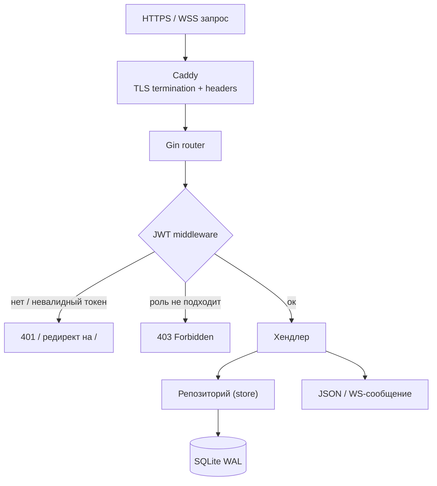
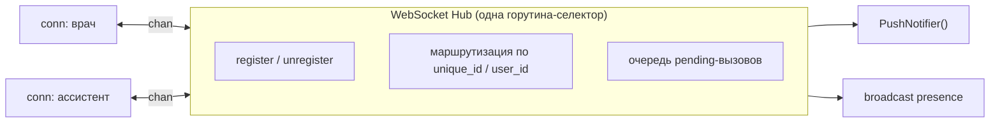
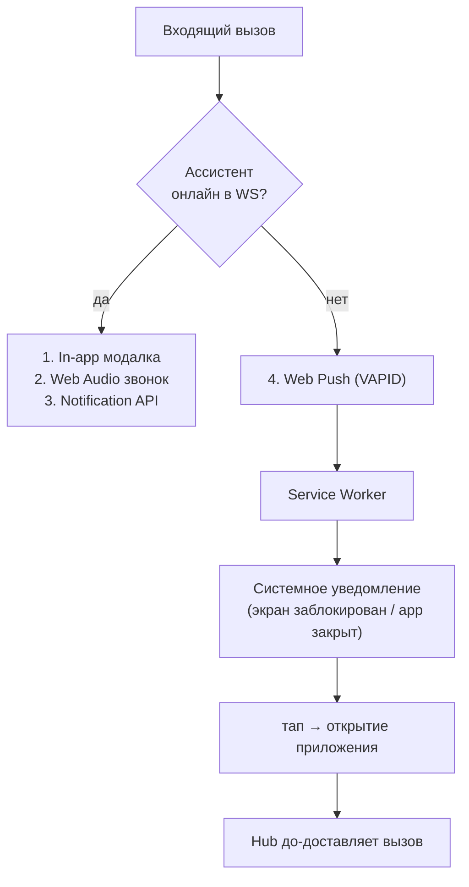
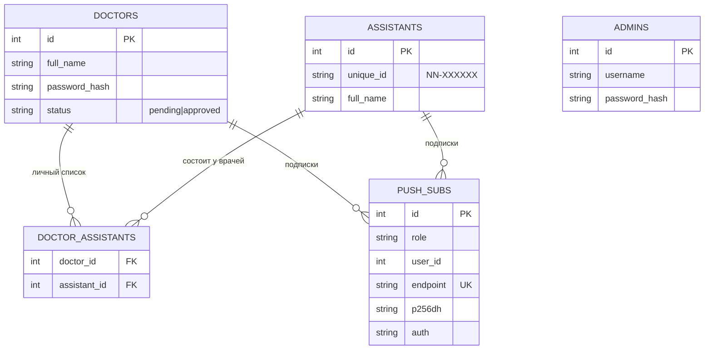
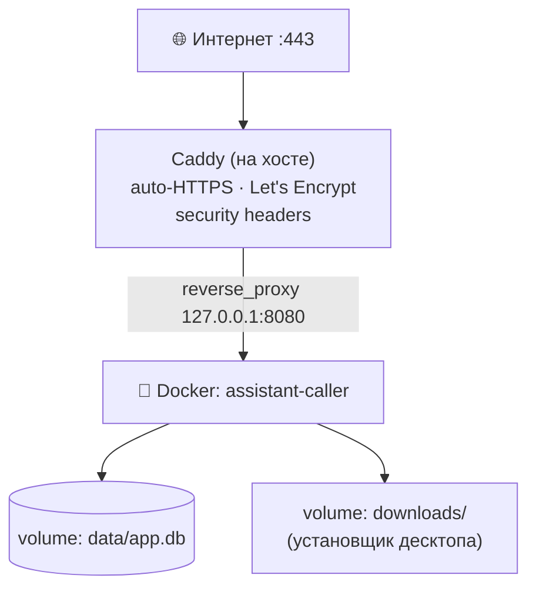

# Архитектура

Технический разбор того, как устроен **NN+ Ассистент-Вызов** изнутри: компоненты, протокол реального времени, доставка уведомлений, модель данных и развёртывание.

---

## Обзор

Система состоит из четырёх частей вокруг одного Go-сервера:

| Часть | Технология | Назначение |
|-------|-----------|-----------|
| Go-сервер | Go + Gin | REST API, WebSocket-хаб, web-push, раздача SPA |
| SPA | React + TS | Кабинеты врача / ассистента / админа |
| PWA | Service Worker | Установка на телефон, push при закрытом приложении |
| Десктоп | PyQt6 | Нативное окно Windows с треем и всплытием |

Один бинарник Go раздаёт и собранный фронтенд, и API, и WebSocket — это упрощает деплой до «один контейнер + один файл БД».

---

## Жизненный цикл запроса

Каждая чувствительная группа роутов обёрнута в middleware `auth.Require(issuer, roles...)`, который:
1. достаёт токен из заголовка `Authorization: Bearer` **или** из query `?token=` (для WebSocket-handshake, где браузер не может выставить заголовки);
2. валидирует подпись и срок;
3. проверяет, что роль из claims входит в список разрешённых для группы.

---

## WebSocket Hub

Сердце системы — конкурентный хаб (`internal/ws/hub.go`), который держит все живые соединения и маршрутизирует сообщения между ними.

Ключевые решения:

- **Единая точка владения состоянием.** Карты соединений и pending-вызовов читает/пишет один селектор-цикл через каналы — без гонок и без россыпи мьютексов.
- **Presence.** При подключении/отключении ассистента хаб рассылает врачам обновлённые онлайн-статусы.
- **Pending re-delivery.** Если вызов ушёл ассистенту, который был оффлайн, он остаётся в очереди и **до-доставляется**, как только ассистент подключится (открыв push-уведомление).
- **Тайм-аут на стороне врача.** Если ассистент не отвечает за заданное время, вызов автоматически снимается, чтобы интерфейс не «висел».

---

## Доставка уведомлений (4 канала)

Надёжность вызова обеспечивается дублированием каналов — хотя бы один точно сработает.

Service Worker показывает системное уведомление **всегда, кроме случая**, когда вкладка прямо сейчас в фокусе (иначе был бы дубль с in-app модалкой).

---

## Модель данных

- **SQLite в режиме WAL** — конкурентное чтение не блокирует запись; для нагрузки клиники более чем достаточно, а деплой — это один файл.
- Драйвер `modernc.org/sqlite` — **чистый Go без CGO**, поэтому образ собирается статически (`CGO_ENABLED=0`) и весит мало.
- Миграции применяются на старте идемпотентно (`CREATE TABLE IF NOT EXISTS` + `INSERT OR IGNORE`).

---

## Аутентификация и роли

- **JWT (HS256).** В claims — `uid` и `role`. Метод подписи при разборе **жёстко проверяется** (`*jwt.SigningMethodHMAC`), что закрывает атаки `alg:none` и подмену RS↔HS.
- **bcrypt** для паролей врачей и админов.
- **Ассистенты** входят без пароля — по уникальному `NN-XXXXXX` (или по ФИО с проверкой). Это намеренно: ассистент — это «терминал приёма вызовов», ценность которого в скорости, а не в секретности; чувствительных данных у него нет.
- **Approval-flow врачей:** регистрация создаёт заявку `pending` → админ подтверждает → только тогда возможен логин.

---

## Развёртывание

- **Multi-stage Docker:** `node:alpine` собирает Vite-бандл → `golang:alpine` компилирует статический бинарник и встраивает фронтенд → финальный образ на `alpine` (только бинарник + ассеты).
- **Caddy** на хосте терминирует TLS (автоматический сертификат Let's Encrypt) и проксирует на контейнер, который слушает **только `127.0.0.1`** — наружу открыт лишь 443.
- БД и установщик десктопа — в Docker-volume, переживают пересборку контейнера.

---

## Почему так

| Решение | Причина |
|---------|---------|
| Go + один бинарник | Простой деплой, низкое потребление памяти, нативная конкурентность для WS |
| WebSocket, а не polling | Задержка вызова критична — нужны миллисекунды |
| Web Push поверх WS | Вызов должен дойти, даже если приложение закрыто или экран заблокирован |
| SQLite, а не Postgres | Нагрузка клиники невелика; «один файл» бьёт оркестрацию БД по простоте |
| PWA + десктоп-обёртка | Ассистенту нужно «всегда на виду»: телефон в кармане + окно на ПК |
| Caddy | Автоматический HTTPS из коробки, конфиг в три строки |
