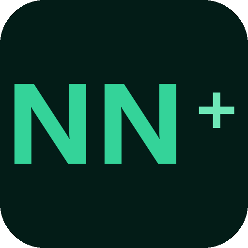
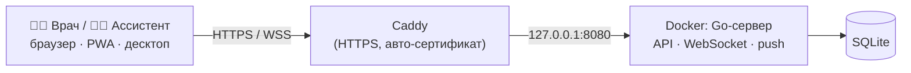

<div align="center">


# Как развернуть своё приложение

Практическое руководство: как поднять NN+ Ассистент-Вызов у себя — для другой клиники, отдела или команды. От пустого сервера до работающего приложения с HTTPS и push-уведомлениями.
</div>

---

## Что вы получите

Одно приложение на трёх «экранах»:

- **Веб-кабинеты** для врача, ассистента и админа (открываются в браузере).
- **PWA** — устанавливается на телефон, шлёт push даже при закрытом приложении.
- **Десктоп-клиент** для Windows (отдельное окно, трей, всплытие при вызове).

Под капотом — один Go-бинарник (API + WebSocket + раздача фронтенда) и файл базы SQLite. Деплой — это **один Docker-контейнер + reverse-proxy с HTTPS**.



---

## Что нужно заранее

| Требование | Зачем |
|---|---|
| Сервер на Linux (1 vCPU / 1 ГБ ОЗУ хватает) | где всё крутится |
| Домен **или** бесплатный `sslip.io` | для HTTPS (push без HTTPS не работает) |
| Docker + Docker Compose | запуск приложения |
| Caddy (или nginx/Traefik) | reverse-proxy + автоматический HTTPS |

> Без HTTPS web-push и установка PWA не работают — это требование браузеров. Самый простой бесплатный HTTPS — Caddy + домен вида `<ВАШ-IP>.sslip.io` (резолвится в ваш IP без покупки домена).

---

## Развёртывание по шагам

### 1. Клонируем и настраиваем секреты

```bash
git clone https://github.com/salim4ek/assistant-caller-by-salim4ek.git
cd assistant-caller-by-salim4ek
cp .env.example .env
```

Откройте `.env` и задайте **обязательно**:

```env
# Сильный случайный секрет (НЕ дефолтный!)
JWT_SECRET=<вставьте: openssl rand -base64 48>

# Первый админ (создаётся автоматически при пустой базе)
ADMIN_USERNAME=admin
ADMIN_PASSWORD=<длинный надёжный пароль>
```

### 2. Ключи для push-уведомлений (VAPID)

```bash
npx web-push generate-vapid-keys
```

Скопируйте в `.env`:

```env
VAPID_PUBLIC=<public key>
VAPID_PRIVATE=<private key>
VAPID_SUBJECT=mailto:you@example.com
```

### 3. Запускаем

```bash
docker compose up -d --build
```

Контейнер слушает `127.0.0.1:8080` (наружу не торчит — доступ только через reverse-proxy).

### 4. HTTPS через Caddy

Установите Caddy на хост и создайте `/etc/caddy/Caddyfile`:

```caddyfile
your-domain.com {
    encode gzip
    header {
        Strict-Transport-Security "max-age=31536000"
        X-Content-Type-Options "nosniff"
        X-Frame-Options "DENY"
        Referrer-Policy "strict-origin-when-cross-origin"
        Permissions-Policy "geolocation=(), camera=(), microphone=()"
        -Server
    }
    reverse_proxy 127.0.0.1:8080 {
        header_up X-Real-IP {remote_host}
    }
}
```

```bash
sudo systemctl reload caddy
```

Caddy сам получит и обновит сертификат Let's Encrypt. Откройте `https://your-domain.com` — увидите экран входа.

> Нет домена? Используйте `<ВАШ-IP>.sslip.io` как `your-domain.com` — работает из коробки.

### 5. Первый вход и роли

1. **Админ:** вкладка со щитом → логин/пароль из `.env`.
2. **Ассистент** регистрируется (только ФИО) → получает ID `NN-XXXXXX`.
3. **Врач** регистрируется (ФИО + пароль) → заявка `pending` → **админ подтверждает** в панели.
4. Врач добавляет ассистентов по ID и шлёт вызовы.

---

## Как это устроено (коротко)

- **Real-time** на WebSocket: врач шлёт `call` → сервер маршрутизирует ассистенту; если тот оффлайн — летит web-push.
- **Роли и доступ** на JWT (HS256) с проверкой роли на каждом защищённом роуте.
- **БД** — один SQLite-файл в Docker-volume (легко бэкапить).

Подробный разбор компонентов, протокола и схемы данных — в [ARCHITECTURE.md](ARCHITECTURE.md).

---

## Кастомизация под себя

| Что | Где |
|---|---|
| Название/брендинг | фронтенд `web-react/src` (логотип `web-react/public/`) |
| Адрес сервера для десктоп-клиента | переменная окружения `NN_URL` (см. [desktop/README](../desktop/README.md)) |
| Поведение уведомлений | service worker `web-react/public/sw.js` |
| Тексты/роли | страницы `web-react/src/pages/` |

---

## Десктоп-клиент (Windows)

Тонкая обёртка на PyQt6 — собирается отдельно, указывает на ваш сервер через `NN_URL`. Инструкция по сборке: [desktop/README.md](../desktop/README.md).

---

## Обновление и бэкапы

```bash
# обновить код и пересобрать
git pull && docker compose up -d --build

# бэкап базы (volume)
docker run --rm -v assistant-caller_appdata:/data -v "$PWD":/backup alpine \
  sh -c "cp /data/app.db /backup/app-backup.db"
```

---

## Если что-то не так

| Симптом | Проверьте |
|---|---|
| Не приходят push | HTTPS включён? VAPID-ключи в `.env`? разрешение в браузере? на iPhone — установлен как PWA, iOS 16.4+? |
| 502 от Caddy | контейнер запущен (`docker compose ps`), слушает `127.0.0.1:8080` |
| Врач не может войти | заявку подтвердил админ? статус `approved`? |
| Сайт не открывается | сертификат выдан (`journalctl -u caddy`)? домен резолвится в IP? |

Перед публикацией в интернет обязательно прочитайте [SECURITY.md](../SECURITY.md).

---

<div align="center">
Вопросы и улучшения — через Issues. Лицензия <a href="../LICENSE">MIT</a> — поднимайте у себя свободно.
</div>
